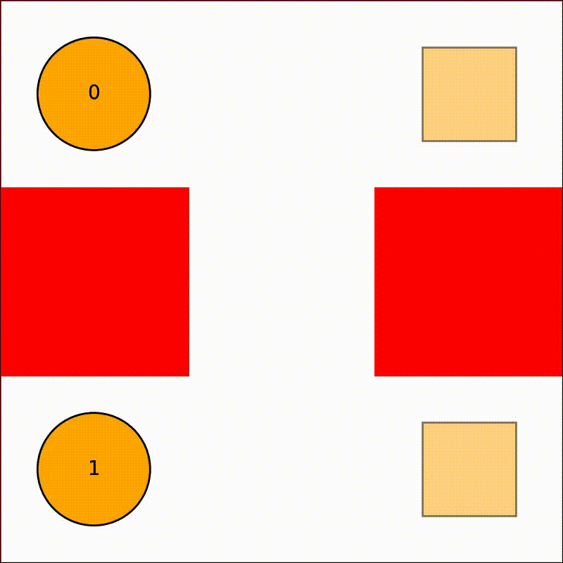
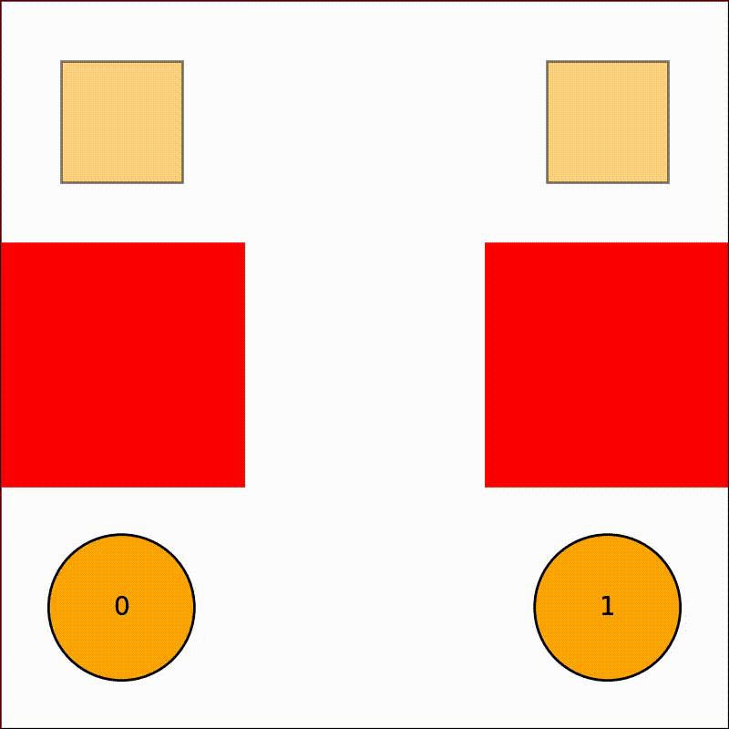
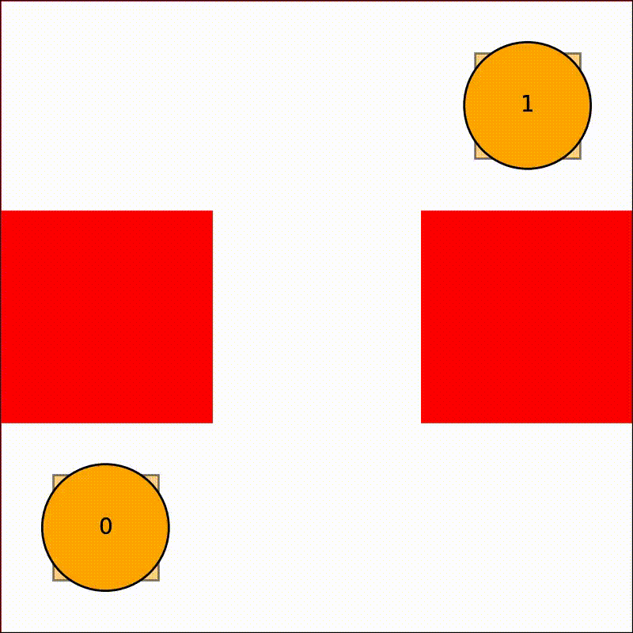
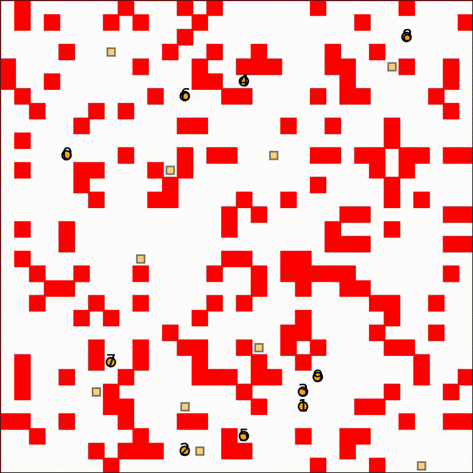

# Multi-Agent path planning in python

## Introduction

This repository consists of the implementation of some multi-agent path-planning algorithms in Python. The following algorithms are currently implemented:

- [Centralized Solutions](#centralized-solutions)
   - [Algorithms](Algorithms)
      - [Prioritized Safe-Interval Path Planning (SIPP)](#prioritized-safe-interval-path-planning)
      - [Conflict-Based Search (CBS)](#conflict-based-search)
   - [Post-Processing](#post-processing)
      - [Post-processing of plan using Temporal Plan Graph](#post-processing-with-tpg)

## Centralized Solutions

In these methods, it is the responsibility of the central planner to provide a plan to the robots.

### Algorithms

#### Prioritized Safe-Interval Path Planning

SIPP is a local planner, using which, a collision-free plan can be generated, after considering the static and dynamic obstacles in the environment. In the case of multi-agent path planning, the other agents in the environment are considered as dynamic obstacles. 

**Execution**

For SIPP multi-agent prioritized planning, run:

``` 
cd ./sipp
python3 multi_sipp.py input.yaml output.yaml
```

**Results**

To visualize the generated results

``` 
python3 visualize_sipp.py input.yaml output.yaml 
```

To record video

``` 
python3 visualize_sipp.py input.yaml output.yaml --video 'sipp.avi' --speed 1
```

|            Test 1 (Success)            |            Test 2 (Failure)            |
|:--------------------------------------:|:--------------------------------------:|
|  | |

#### Conflict Based Search

Conclict-Based Search (CBS), is a multi-agent global path planner.

**Execution**

Run:

``` 
cd ./cbs
python3 cbs.py input.yaml output.yaml
```

**Results**

To visualize the generated results:

``` shell
python3 ../visualize.py input.yaml output.yaml
```

|           Test 1 (Success)           |           Test 2 (Success)           |
|:------------------------------------:|:------------------------------------:|
| | |

|               8x8 grid              |              32x32 grid             |
|:-----------------------------------:|:-----------------------------------:|
|  | |

## Post-Processing

### Post-processing with TPG

The plan, which is computed in discrete time, can be postprocessed to generate a plan-execution schedule, that takes care of the kinematic constraints as well as imperfections in plan execution.

This work is based on: [Multi-Agent Path Finding with Kinematic Constraints](https://www.aaai.org/ocs/index.php/ICAPS/ICAPS16/paper/view/13183/12711)

Once the plan is generated using CBS, please run the following to generate the plan-execution schedule:

``` shell
cd ./scheduling
python minimize.py ../cbs/output.yaml real_schedule.yaml
```
